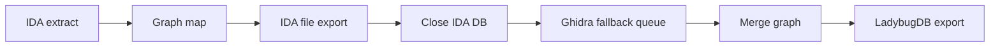

# Extraction Engine and Graph Mapper

## 概述

当前核心流程以“提取原始数据 -> 映射为图模型”为主线：

1. `core/extraction/engine.py` 负责调用 IDA/idalib，抽取原始 DTO（`RawBinaryData`）。
2. `core/mapping/graph_mapper.py` 将 `RawBinaryData` 映射为 `GraphData`（节点/边）。
3. `exporters/export_manager.py` 负责导出到 LadybugDB/文件。

该流程取代了旧版一体化提取器和 standalone analyzer 实现，职责更清晰、可扩展性更强。

## 已实现功能

### 1. 原始数据提取（ExtractionEngine）

- 二进制元信息（`RawBinaryInfo`）
- 函数（`RawFunction`）
- 字符串（`RawString`）
- 全局变量（`RawGlobal`）
- 结构体成员（`RawStructMember`）
- 调用关系（`RawCall`）
- 字符串引用（`RawStringRef`）
- 导入信息（`RawImport`）
- 数据访问（`RawDataAccess`，启用数据流分析时）
- Ghidra fallback 队列（`RawGhidraFallback`，仅用于 Hex-Rays 硬限制）

### 2. 图模型映射（GraphMapper）

- 生成 Binary/Function/DataSlot/String 节点
- 构建 CONTAINS/CALLS/REFERENCES/LINKS_TO/READS/WRITES 等边
- 结构体成员统一命名与跨二进制 ID 生成
- 将 `RawGhidraFallback` 的 VA 转为 Function UID/RVA，并保存到 `GraphData.ghidra_fallbacks`

### 3. 导出（ExportManager）

- LadybugDB 文件写入（`graph.lbug`）
- 可选文件导出（伪 C/结构体/表）
- 将导出路径直接回填到 `Function.decompiled_file` / `DataSlot.struct_file`
- 生成 `_export_manifest.json`，并把 manifest 路径和文件哈希写入 `Binary`
- IDA 数据库关闭后按 `export.ghidra_fallback` 配置运行 Ghidra fallback，并把 `ghidra_decompile` 路径回填到对应函数

## Hex-Rays 失败分类

Hex-Rays harvest 以单个 `cfunc_t` 为单位处理函数，避免重复调用 `ida_hexrays.decompile()`。失败分为三类：

- safe skip：import、external、no body、thunk 等没有真实函数体或不应反编译的目标。
- fallback queue：`stack frame is too big`，属于 Hex-Rays 硬限制，进入 `RawGhidraFallback`。
- hard failure：其它 meaningful function decompile failure，会直接抛出 `RuntimeError` 阻断分析。

Ghidra fallback 只补充 Hex-Rays 因硬限制无法处理的函数。输出保持 `artifact_type='ghidra_decompile'` 和文件头 provenance，不会混入 Hex-Rays ctree 语义结果。

## 项目同步顺序



## 使用方法

### 方式 1：基于 API 的分析流程

```python
from core.extraction.engine import ExtractionEngine
from core.mapping.graph_mapper import GraphMapper

engine = ExtractionEngine(binary_path, enable_dataflow=True)
raw_data = engine.extract()

with open(binary_path, "rb") as f:
    binary_content = f.read()

mapper = GraphMapper(binary_content=binary_content)
graph_data = mapper.map(raw_data)
```

### 方式 2：CLI 同步项目

```bash
ida-graphy project sync <project_name>
```

## 依赖关系

```
extraction/engine.py
  -> extraction/raw_data.py
  -> extraction/ida_adapter.py
  -> extraction/hexrays_harvest.py
  -> extraction/call_analyzer.py
  -> extraction/dataflow.py

mapping/graph_mapper.py
  -> mapping/id_generator.py
  -> mapping/struct_normalizer.py
  -> mapping/symbol_resolver.py
  -> models.py

exporters/export_manager.py
  -> exporters/file_exporter.py
  -> exporters/ghidra_fallback.py
  -> exporters/artifact_utils.py
  -> exporters/ladybugdb_exporter.py
```

## 测试建议

1. 小型 EXE：验证函数与字符串提取
2. DLL：验证导入/导出处理
3. 大型二进制：验证性能与稳健性

## 已知限制

1. 数据流分析依赖 Hex-Rays（可用时自动启用）
2. 跨二进制 LINKS_TO 需要多文件协同分析
3. `stack frame is too big` 只能通过 Ghidra fallback 补充上下文，不能当作 Hex-Rays ctree 等价结果
